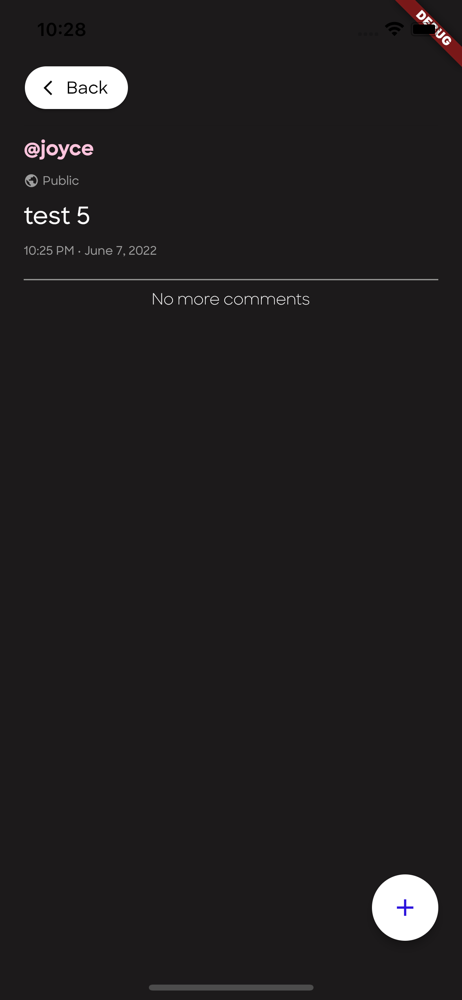

### Project by Marlo Fiel Mancenido (X-3L)
# barda - a social media app
barda is a social media application developed in Flutter. It uses elements from both the Material UI package and Cupertino package. It connects through the provided API for CRUD actions. 

### Dependencies:
* **http** - for CRUD actions through the provided API
* **flutter_session** - handling authentication and creating a session
* **intl** - certain formatting functions

### Features:
* **User Registration** - allows user to make a new account

* **Logging in** - allows user to sign in to the app with their credentials

* **Viewing all public posts** - shows the feed page that shows all public posts (and your friends' posts)

* **Viewing a post** - each post has their own individual page

* **Making a post (public/private)** - you can make public/private posts

* **Commenting on a post** - making a comment on a post

* **Removing a comment** - press the delete button to delete a comment

* **Editing a post** - you can edit your own posts

* **Removing a post** - you can delete your own posts

* **Viewing a profile** - you can view someone's profile

* **Following a person** - you can follow someone by pressing the follow button

* **Showing a user's posts** - you can view someone's posts in their profile

* **Viewing a profile** - you can view someone's profile

* **Unfollowing a person** - you can unfollow someone

* **Updating password** - you can change your password in the settings section of your profile

* **Listing all following** - you can see who you're following in your profile

* **Logging out** - you can log out from the session through the log out button in the settings section.

### Happy Paths
* Everything seemed to be working upon testing. 

### Unhappy Paths
* Several unhappy paths were caught and displayed as errors to the user. The caught unhappy paths are as follow:
    - Registering with empty fields
    - Logging in with empty fields
    - Updating your password with wrong old password
    - Updating your password with non-matching passwords
    - All server requests that return with an error 
* An unresolved unhappy path would be the pages with pagination widgets that needs manual refreshing after a context pop. *(Deleting your own post and automatically going back. Your post will still show up and page will need refreshing to not show it.)*
